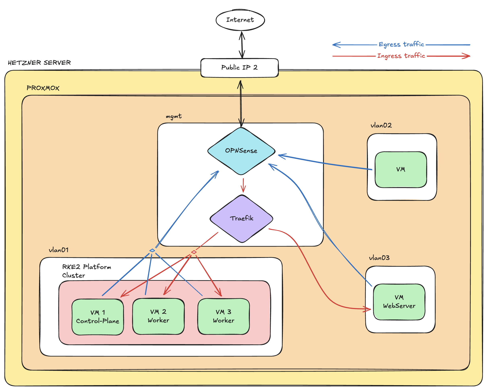

# Proxmox Home Lab

<a href="https://github.com/sergioaten">
  
</a>This project aimed to create a scalable and secure home lab environment using Proxmox and various open-source tools. The goal is to automate the deployment and management of infrastructure components while ensuring best practices for security and maintainability.

<br>My background is primarily in cloud infrastructure management (specialized in Azure). Due to a career transition, I need to reinvent myself and return to lower-level infrastructure management. (In cloud environments, everything is very abstract and magical). This project serves as a learning platform to deepen my understanding of infrastructure management in a more controlled and customizable environment.

## Repository Structure

```
.github/
├── README.md                    # This documentation
├── vault-helper.sh             # Vault authentication and secret management script
├── vault-agent.hcl             # Vault agent configuration
├── .github/workflows/          # GitHub Actions workflows
│   └── *.yaml                 # Workflow definitions (terragrunt, etc.)
└── iac/                        # Infrastructure as Code
    ├── root.hcl               # Root Terragrunt configuration
    └── <environments>/        # Environment-specific configurations
        ├── env.hcl           # Environment variables and settings
        └── <stacks>/         # Service/functional area stacks
            └── terragrunt.stack.hcl  # Stack definitions with units
```

## Base Infrastructure

### Initial Infrastructure

These services will be consumed by deployed infrastructure


- Hashicorp Vault. Manages secrets and sensitive data.
- PostgreSQL. Manages the terraform/terragrunt state.

### Target infrastructure



The main target for this project is to learn and implement a robust infrastructure automation solution. In the networking side, we will have a hub-and-spoke model.

- **Hub**: Centralized management and routing
  - OPNSense. A powerful open-source firewall and routing platform. It will control the traffic in the hub.
  - Traefik. Will be a centralized reverse proxy and load balancer.

## Hashichorp Vault Integration

### ¿Why not using Vault Agent?

The decision not to use the native Vault Agent stems from a key architectural limitation: any process requiring secret access must run as a child process of the Vault Agent to inherit the injected environment variables. This constraint limits flexibility when working with diverse toolchains and deployment scenarios.

Instead, I've implemented a general-purpose secret injection approach that works across any process or workflow, providing greater flexibility for infrastructure automation pipelines and development workflows.

### vault-helper.sh

The `vault-helper.sh` script is a comprehensive Vault integration utility that orchestrates secure secret management for the infrastructure automation pipeline. It provides:

**Key Features:**

- **Token Management**: Automatically handles Vault token lifecycle (reuse, refresh, or new authentication)
- **AppRole Authentication**: Supports Vault AppRole authentication method using `VAULT_CLIENT_ID` and `VAULT_SECRET_ID`
- **Environment Loading**: Safely loads secrets from Vault into environment variables
- **GitHub Actions Integration**: Automatically masks sensitive values in GitHub Actions logs
- **Cleanup**: Removes temporary files containing secrets after loading

**Usage:**

```bash
# Source the script to load secrets into the current shell
source vault-helper.sh
```

**Required Environment Variables:**

- `VAULT_ADDR`: Vault server address
- `VAULT_AGENT_CONFIG`: Path to vault-agent.hcl configuration file
- `VAULT_CLIENT_ID`: AppRole role ID (for initial authentication)
- `VAULT_SECRET_ID`: AppRole secret ID (for initial authentication)

**Optional Environment Variables:**

- `VAULT_TOKEN`: Existing token to reuse
- `TOKEN_FILE`: Custom path for token storage (default: `.vault_config/token`)
- `CLEAN_ENV_AFTER_LOAD`: Whether to clean env files after loading (default: 1)
- `VAULT_CACERT`: Path to CA certificate for TLS verification

### vault-agent.hcl

The `vault-agent.hcl` configuration file defines how Vault Agent retrieves and templates secrets:

- **Configuration Structure:**

  - **Auto-authentication**: Uses token file method for authentication
  - **Template Generation**: Creates environment files for different secret scopes
  - **Exit Strategy**: Configured to exit after authentication and template generation

- **Generated Secret Files:**

  The vault agent generates environment files based on the templates defined in `vault-agent.hcl`. The specific files created depend on:

  - Templates configured in the vault-agent configuration
  - Secrets available in the Vault server
  - Environment-specific requirements

  Common patterns include files for provider authentication, backend configuration, and application-specific secrets.

- **Security Features:**

  - File permissions set to `0600` (owner read/write only)
  - Automatic cleanup after secret loading
  - Template-based secret injection to avoid hardcoded values

## Infrastructure as Code (IaC) with Terragrunt

### Architecture: Stacks and Units

The repositories implements a modern IaC architecture using Terragrunt's **stacks and units** pattern, providing:

- **Modularity**: Reusable infrastructure components
- **Environment Separation**: Clear isolation between environments
- **Dependency Management**: Automated resource dependency handling
- **DRY Principle**: Shared configuration with environment-specific overrides

### Structure Explanation

#### Root Configuration (`iac/root.hcl`)

The root configuration provides foundational settings that are inherited by all stacks and units:

- **Environment Variable Integration**: Merges environment-specific variables from `env.hcl` files
- **Remote State Management**: Configures backend storage with dynamic schema naming
- **Provider Generation**: Automatic provider configuration for consistent authentication
- **Shared Settings**: Common configuration patterns used across all deployments

#### Environment Configuration Pattern

Each environment (dev, staging, prod, etc.) has its own directory containing:

- **`env.hcl`**: Environment-specific variables and configuration
- **Stack directories**: Organized by functional areas or services
- **Local overrides**: Environment-specific customizations

Example structure:

```
iac/
├── root.hcl
├── dev/
│   ├── env.hcl
│   └── [service-stacks]/
├── staging/
│   ├── env.hcl
│   └── [service-stacks]/
└── prod/
    ├── env.hcl
    └── [service-stacks]/
```

#### Stack Definition Pattern

Stacks are collections of related infrastructure units that are deployed together. Each stack:

- **Groups related resources**: Organizes units by functional domain
- **Manages dependencies**: Ensures proper deployment order
- **Provides isolation**: Allows independent stack management
- **Enables versioning**: Uses git references for module versions

**Common Unit Patterns:**

- **Infrastructure Units**: Core infrastructure components (networks, storage, compute)
- **Application Units**: Service-specific deployments and configurations
- **Security Units**: Access management, policies, and compliance resources
- **Monitoring Units**: Observability and alerting infrastructure

**Unit Structure Standards:**

- **Source**: References to modules in the infrastructure catalog
- **Path**: Unique deployment path within the stack
- **Values**: Unit-specific configuration and parameters

### Terragrunt Workflow

The IaC deployment follows this workflow:

1. **Planning Phase** (Pull Requests):

   - Triggered on PR creation/updates affecting `iac/**` paths
   - Generates and comments Terragrunt plans on PRs
   - Validates configuration without applying changes

2. **Apply Phase** (Issue Comments):
   - Triggered by specific comments on PRs (e.g., `/apply`)
   - Executes Terragrunt apply
   - Updates infrastructure based on approved changes
   - Merges changes into the main branch

### Key Benefits

- **Consistency**: Standardized infrastructure patterns across environments
- **Security**: Vault-integrated secret management with automatic masking
- **Scalability**: Easy addition of new environments and services
- **Traceability**: Git-based change tracking with PR approval workflow
- **Reusability**: Shared modules from infrastructure catalog

## Getting Started

### Prerequisites

- Access to Vault server with AppRole authentication configured
- GitHub repository with appropriate permissions
- Terragrunt and Terraform installed locally (for development)

### Local Development

1. **Set up Vault credentials:**

   ```bash
   export VAULT_ADDR="<your-vault-server-url>"
   export VAULT_CLIENT_ID="<your-role-id>"
   export VAULT_SECRET_ID="<your-secret-id>"
   export VAULT_AGENT_CONFIG="./vault-agent.hcl"
   ```

2. **Load secrets:**

   ```bash
   source vault-helper.sh
   ```

3. **Run Terragrunt commands:**

   ```bash
   export TG_WORKING_DIR="iac"
   # Plan changes across all iac
   terragrunt run --all plan

   # Apply changes (use with caution)
   terragrunt run --all apply

   # Work with specific environments or stacks
   cd iac/<environment>/<stack>/
   terragrunt stack run plan
   terragrunt stack run apply
   ```

### GitHub Actions Usage

The repository automatically handles infrastructure changes through:

1. **Pull Request Creation**: Generates plans and posts the step URL to check the plan results
2. **Comment-based Apply**: Use `.apply` comments on PRs to trigger deployments and posts the step URL to check the apply results
3. **Automated Secret Management**: Vault integration handles all secret injection
4. **Merge Changes**: After apply, you can check the status going to the URL and if the changes were successful, merge them into the main branch

## Main Repositories

| Repository                                                                                    | Description                                                                  |
| --------------------------------------------------------------------------------------------- | ---------------------------------------------------------------------------- |
| [**repo-github-actions**](https://github.com/proxmox-home-lab/github-actions)                 | Contains GitHub Actions and reusable workflows                               |
| [**repo-infrastructure-catalog**](https://github.com/proxmox-home-lab/infrastructure-catalog) | Holds the infrastructure catalog with reusable Terraform and Terragrunt code |
| [**repo-packer-images**](https://github.com/proxmox-home-lab/packer-images)                   | Stores Packer templates for creating proxmox VM Images                       |
